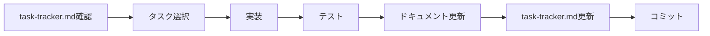

# 対話型AIチャット機能 ドキュメント

## 概要

このディレクトリには、Renkeiシステムの対話型AIチャット機能に関するすべてのドキュメントが含まれています。

## ドキュメント構成

### 📋 主要ドキュメント

1. **[implementation-plan.md](./implementation-plan.md)**
   - 機能の全体設計と実装計画
   - アーキテクチャ図
   - タスク一覧

2. **[progress-management.md](./progress-management.md)**
   - 進捗管理の方法論
   - ドキュメント更新ルール
   - 品質管理基準

3. **[task-tracker.md](./task-tracker.md)** 📍
   - **現在の進捗状況**
   - 各タスクの詳細と状態
   - 次の作業計画

4. **[technical-decisions.md](./technical-decisions.md)**
   - 技術的な決定事項の記録
   - 選択した理由と影響
   - 却下された提案

### 📁 サブディレクトリ

- **meeting-notes/**
  - 打ち合わせや議論の記録
  - 決定事項のメモ

- **code-snippets/**
  - 再利用可能なコード例
  - 実装パターン

## 🚀 クイックスタート

### 新しいセッションを開始する場合

1. **現在の状況を把握**
   ```bash
   cat docs/features/interactive-chat/task-tracker.md
   ```

2. **前回の更新を確認**
   ```bash
   git log -1 --oneline -- docs/features/interactive-chat/
   ```

3. **作業ブランチを作成**
   ```bash
   git checkout -b feat/interactive-chat
   ```

### 作業を再開する場合

1. **task-tracker.mdを確認**
   - 現在の進捗
   - ブロッカー
   - 次の優先タスク

2. **technical-decisions.mdを確認**
   - 最新の技術的決定
   - 保留中の検討事項

3. **実装を継続**
   - 優先タスクから着手
   - 進捗を随時更新

## 📊 現在のステータス

- **全体進捗**: 0% (0/13 タスク)
- **現在のフェーズ**: Phase 1 - 基盤構築
- **次の優先タスク**: tmuxレイアウト拡張

## 🔄 ワークフロー



## 📝 ドキュメント更新ルール

1. **作業開始時**
   - task-tracker.mdでタスクを「進行中」に更新

2. **実装中**
   - 技術的決定があればtechnical-decisions.mdに記録
   - 再利用可能なコードはcode-snippets/に保存

3. **作業終了時**
   - task-tracker.mdを更新（進捗、成果物、次のステップ）
   - 必要に応じて他のドキュメントも更新

## 🎯 成功の指標

- [ ] すべてのタスクが完了
- [ ] テストカバレッジ80%以上
- [ ] ドキュメントが最新
- [ ] パフォーマンス基準を満たす

## 📞 連絡先

- **機能オーナー**: happy_ryo
- **技術リード**: Claude
- **レビュアー**: TBD

## 🔗 関連リンク

- [Renkei README](/README.md)
- [開発ガイドライン](/CLAUDE.md)
- [アーキテクチャドキュメント](/docs/renkei/02-architecture-design.md)