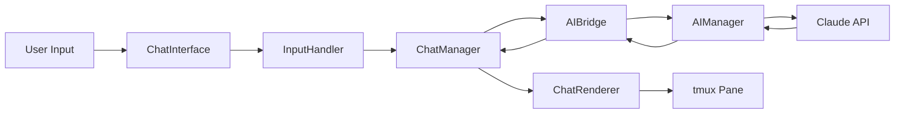

# 対話型AIチャット機能 実装計画書

## 1. 概要

Renkeiシステムに対話型AIチャット機能を追加し、統括AIとのリアルタイムな対話を可能にします。

### 1.1 目的
- 統括AIとの直接的な対話インターフェースの提供
- タスク実行中のリアルタイムな指示・調整機能
- より直感的なシステム操作体験

### 1.2 スコープ
- tmuxレイアウトの3ペイン構成への拡張
- 対話型チャットインターフェースの実装
- AIManagerとの双方向通信機能
- コマンド履歴とコンテキスト管理

## 2. 機能要件

### 2.1 ユーザーインターフェース要件
- **対話型プロンプト**
  - チャット形式の入力インターフェース
  - リアルタイムのレスポンス表示
  - タイピング中のインジケーター表示
  
- **コマンド機能**
  - コマンド履歴（上下キーでナビゲーション）
  - タブ補完機能
  - 特殊コマンド（/help、/clear、/exit等）

- **表示機能**
  - メッセージのタイムスタンプ表示
  - ユーザー/AI発言の区別
  - マークダウン形式のサポート
  - スクロール機能

### 2.2 システム要件
- **非同期処理**
  - 入力とレスポンスの非同期処理
  - タスク実行中の対話継続
  - イベント駆動アーキテクチャ

- **状態管理**
  - 会話履歴の保持
  - コンテキスト情報の管理
  - セッション復元機能

## 3. アーキテクチャ設計

### 3.1 tmuxレイアウト構成

```
┌─────────────────────────────────────────┐
│                                         │
│         AI Manager (Main Pane)          │
│                 (50%)                   │
│                                         │
├────────────────────┬────────────────────┤
│                    │                    │
│   AI Chat Pane     │  Worker Status    │
│      (25%)         │     (25%)         │
│                    │                    │
└────────────────────┴────────────────────┘
```

### 3.2 コンポーネント構成

```
src/
├── ui/
│   ├── chat/
│   │   ├── chat-interface.ts      # メインインターフェース
│   │   ├── chat-renderer.ts       # 表示制御
│   │   ├── input-handler.ts       # 入力処理
│   │   └── command-processor.ts   # コマンド解析
│   └── layouts/
│       └── three-pane-layout.ts   # 3ペインレイアウト
├── managers/
│   ├── chat-manager.ts            # チャット管理
│   └── ai-bridge.ts               # AI連携ブリッジ
├── interfaces/
│   └── chat-types.ts              # チャット関連型定義
└── utils/
    └── chat-history.ts            # 履歴管理

```

### 3.3 データフロー



## 4. 実装タスク詳細

### Phase 1: 基盤構築（優先度: 高）

#### Task 1.1: tmuxレイアウト拡張
- **説明**: 3ペイン構成への変更
- **ファイル**: 
  - `scripts/renkei-start`
  - `src/ui/layouts/three-pane-layout.ts`
- **完了条件**: 3つのペインが正しく配置される

#### Task 1.2: 設定ファイル拡張
- **説明**: チャットペイン用の設定追加
- **ファイル**: 
  - `config/default-settings.json`
  - `src/interfaces/types.ts`
- **完了条件**: 新設定が読み込まれる

#### Task 1.3: 基本型定義
- **説明**: チャット機能の型定義
- **ファイル**: `src/interfaces/chat-types.ts`
- **完了条件**: TypeScript型チェックが通る

### Phase 2: チャットインターフェース（優先度: 高）

#### Task 2.1: ChatInterface実装
- **説明**: メインのチャットインターフェース
- **ファイル**: `src/ui/chat/chat-interface.ts`
- **完了条件**: 基本的な入出力が動作する

#### Task 2.2: InputHandler実装
- **説明**: ユーザー入力の処理
- **ファイル**: `src/ui/chat/input-handler.ts`
- **完了条件**: キー入力が正しく処理される

#### Task 2.3: ChatRenderer実装
- **説明**: メッセージ表示制御
- **ファイル**: `src/ui/chat/chat-renderer.ts`
- **完了条件**: メッセージが正しく表示される

### Phase 3: マネージャー実装（優先度: 中）

#### Task 3.1: ChatManager実装
- **説明**: チャット全体の制御
- **ファイル**: `src/managers/chat-manager.ts`
- **完了条件**: チャットセッションが管理される

#### Task 3.2: AIBridge実装
- **説明**: AIManagerとの連携
- **ファイル**: `src/managers/ai-bridge.ts`
- **完了条件**: AIManagerとの通信が確立する

### Phase 4: 高度な機能（優先度: 低）

#### Task 4.1: コマンドプロセッサー
- **説明**: 特殊コマンドの処理
- **ファイル**: `src/ui/chat/command-processor.ts`
- **完了条件**: /helpなどが動作する

#### Task 4.2: 履歴管理
- **説明**: 会話履歴の保存・復元
- **ファイル**: `src/utils/chat-history.ts`
- **完了条件**: 履歴が永続化される

### Phase 5: テストとドキュメント（優先度: 中）

#### Task 5.1: ユニットテスト
- **説明**: 各コンポーネントのテスト
- **ファイル**: `src/**/__tests__/*.test.ts`
- **完了条件**: カバレッジ80%以上

#### Task 5.2: 統合テスト
- **説明**: システム全体のテスト
- **ファイル**: `src/__tests__/e2e/chat-integration.test.ts`
- **完了条件**: E2Eテストが通る

#### Task 5.3: ドキュメント更新
- **説明**: README、CLAUDE.mdの更新
- **ファイル**: `README.md`, `CLAUDE.md`
- **完了条件**: 新機能が文書化される

## 5. 技術仕様

### 5.1 入力処理
```typescript
interface ChatMessage {
  id: string;
  timestamp: Date;
  sender: 'user' | 'ai';
  content: string;
  metadata?: {
    tokenCount?: number;
    processingTime?: number;
    error?: string;
  };
}
```

### 5.2 イベントシステム
```typescript
enum ChatEvents {
  USER_INPUT = 'chat:user_input',
  AI_RESPONSE = 'chat:ai_response',
  AI_THINKING = 'chat:ai_thinking',
  ERROR = 'chat:error',
  CLEAR = 'chat:clear',
  HISTORY_LOAD = 'chat:history_load'
}
```

### 5.3 コマンドAPI
```typescript
interface ChatCommand {
  name: string;
  description: string;
  handler: (args: string[]) => Promise<void>;
}

// 例：
const commands: ChatCommand[] = [
  {
    name: '/help',
    description: 'ヘルプを表示',
    handler: async () => { /* ... */ }
  },
  {
    name: '/clear',
    description: '画面をクリア',
    handler: async () => { /* ... */ }
  },
  {
    name: '/task',
    description: 'タスクを作成',
    handler: async (args) => { /* ... */ }
  }
];
```

## 6. 非機能要件

### 6.1 パフォーマンス
- レスポンス時間: < 100ms（ローカル処理）
- メモリ使用量: < 50MB（チャット機能）
- 履歴保持: 最大1000メッセージ

### 6.2 ユーザビリティ
- キーボードショートカット対応
- Emacsスタイルのキーバインド
- カスタマイズ可能な表示設定

### 6.3 エラーハンドリング
- 優雅な劣化（グレースフルデグラデーション）
- エラーメッセージの明確化
- リトライ機能

## 7. リスクと対策

### 7.1 技術的リスク
- **tmux制御の複雑化**
  - 対策: 既存のTmuxManagerを拡張
  - フォールバック: 2ペイン構成での動作

- **非同期処理の競合**
  - 対策: イベントキューの実装
  - ロック機構の導入

### 7.2 UXリスク
- **画面の狭さ**
  - 対策: レスポンシブレイアウト
  - ペインサイズの動的調整

## 8. 成功指標

- チャット応答時間 < 1秒
- ユーザー満足度の向上
- タスク実行効率の20%向上
- バグ発生率 < 5%

## 9. 今後の拡張可能性

- 音声入力対応
- マルチモーダル対応（画像、ファイル）
- プラグインシステム
- Web UI版の提供