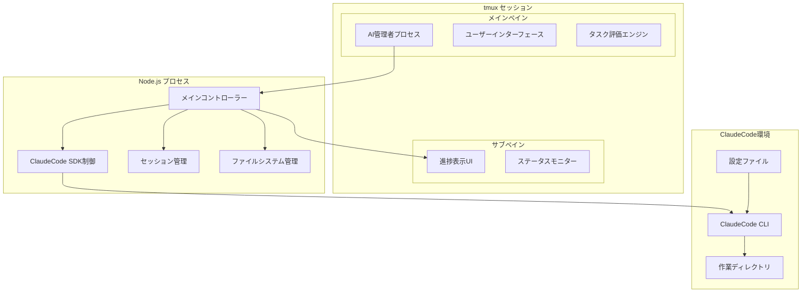
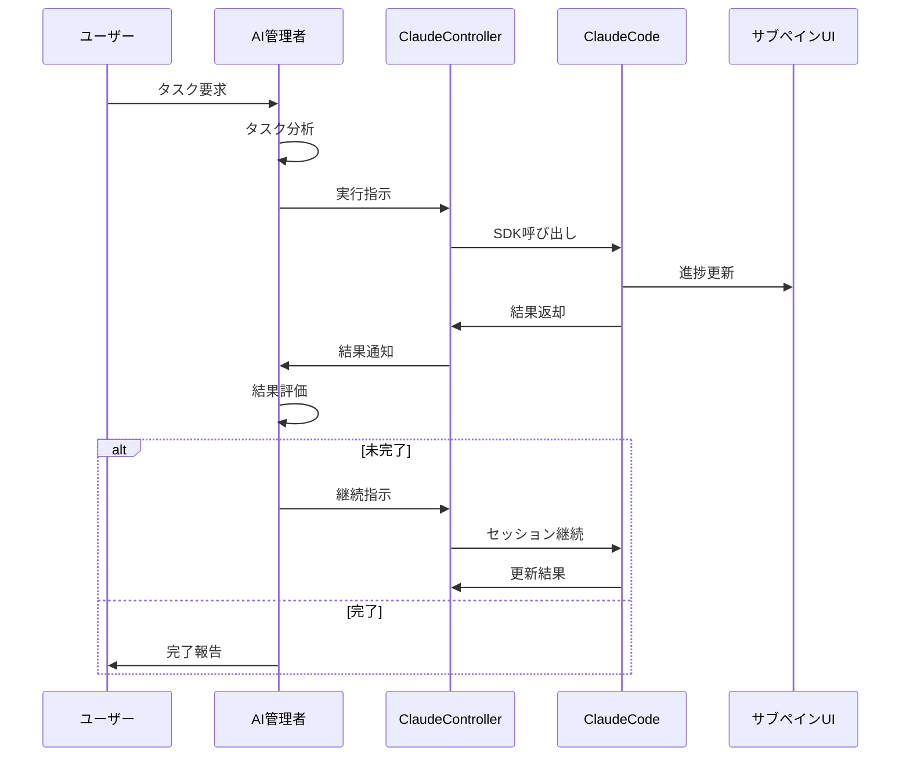

# Renkei System - アーキテクチャ設計

## システムアーキテクチャ概要

Renkeiシステムは以下の主要コンポーネントで構成されるマルチプロセスアーキテクチャを採用します。

### 全体アーキテクチャ図



## コンポーネント詳細設計

### 1. tmux セッション管理

**責務**: 2ペイン環境の管理と制御

```typescript
class TmuxManager {
    private sessionName = 'renkei';
    
    async createSession(): Promise<void> {
        // セッション作成
        await this.execCommand(`tmux new-session -d -s ${this.sessionName}`);
        
        // 水平分割
        await this.execCommand(`tmux split-window -h -t ${this.sessionName}`);
        
        // ペインタイトル設定
        await this.execCommand(`tmux select-pane -t ${this.sessionName}:0.0 -T "AI Manager"`);
        await this.execCommand(`tmux select-pane -t ${this.sessionName}:0.1 -T "ClaudeCode"`);
    }
    
    async sendToPane(paneId: string, message: string): Promise<void> {
        await this.execCommand(`tmux send-keys -t ${this.sessionName}:${paneId} "${message}" Enter`);
    }
}
```

### 2. AI管理者システム

**責務**: ユーザー対話、タスク設計、結果評価

```typescript
class AIManager {
    private taskEvaluator: TaskEvaluator;
    private claudeController: ClaudeController;
    
    async processUserRequest(request: string): Promise<TaskResult> {
        // 1. タスク分析
        const taskAnalysis = await this.analyzeTask(request);
        
        // 2. 実行計画作成
        const executionPlan = await this.createExecutionPlan(taskAnalysis);
        
        // 3. ClaudeCode実行
        let result = await this.claudeController.executeTask(executionPlan);
        
        // 4. 結果評価ループ
        while (!this.taskEvaluator.isComplete(result, request)) {
            const feedback = await this.taskEvaluator.generateFeedback(result, request);
            result = await this.claudeController.continueTask(feedback, result.session_id);
        }
        
        return result;
    }
}
```

### 3. ClaudeCode SDK制御

**責務**: ClaudeCode APIの呼び出しと管理

```typescript
class ClaudeController {
    private activeSession: string | null = null;
    
    async executeTask(prompt: string): Promise<TaskResult> {
        const messages: SDKMessage[] = [];
        
        for await (const message of query({
            prompt: prompt,
            options: {
                allowedTools: this.getAllowedTools(),
                outputFormat: 'json',
                maxTurns: 10,
                sessionId: this.activeSession
            }
        })) {
            messages.push(message);
            this.updateProgressDisplay(message);
        }
        
        const result = messages[messages.length - 1];
        this.activeSession = result.session_id;
        
        return result;
    }
    
    private getAllowedTools(): string[] {
        return [
            "Write", "Read", "Edit", "MultiEdit",
            "Bash(npm:*)", "Bash(git:*)", "Bash(mkdir:*)",
            "Bash(ls:*)", "Bash(pwd)", "Bash(cat:*)"
        ];
    }
}
```

## 通信設計

### 1. プロセス間通信

**AI管理者 ↔ ClaudeCode制御**
- **方式**: 直接関数呼び出し（同一プロセス内）
- **データ形式**: TypeScriptオブジェクト
- **非同期処理**: Promise/async-await

**メインプロセス ↔ tmux UI**
- **方式**: tmuxコマンド実行
- **データ形式**: 文字列（コマンドライン）
- **更新頻度**: リアルタイム

### 2. セッション管理通信

```typescript
interface SessionState {
    sessionId: string;
    startTime: Date;
    currentTask: string;
    status: 'planning' | 'executing' | 'evaluating' | 'completed';
    totalCost: number;
    turnCount: number;
}

class SessionManager {
    private sessions = new Map<string, SessionState>();
    
    async saveSession(sessionId: string, state: SessionState): Promise<void> {
        this.sessions.set(sessionId, state);
        await this.persistToDisk(sessionId, state);
    }
    
    async restoreSession(sessionId: string): Promise<SessionState | null> {
        return this.sessions.get(sessionId) || await this.loadFromDisk(sessionId);
    }
}
```

### 3. ファイルシステム通信

**設定ファイル管理**
```typescript
interface SystemConfig {
    permissions: PermissionConfig;
    workspace: WorkspaceConfig;
    ui: UIConfig;
}

class ConfigManager {
    private configPath = '.claude/settings.json';
    
    async loadConfig(): Promise<SystemConfig> {
        const content = await fs.readFile(this.configPath, 'utf-8');
        return JSON.parse(content);
    }
    
    async saveConfig(config: SystemConfig): Promise<void> {
        await fs.writeFile(this.configPath, JSON.stringify(config, null, 2));
    }
}
```

## データフロー設計

### 1. 実行フロー



### 2. データ永続化

**セッションデータ**
```json
{
  "sessionId": "uuid-v4",
  "startTime": "2025-06-18T09:00:00Z",
  "userRequest": "Reactアプリを作成",
  "taskPhases": [
    {
      "phase": "analysis",
      "prompt": "...",
      "result": "...",
      "cost": 0.05
    }
  ],
  "totalCost": 0.25,
  "status": "completed"
}
```

**設定データ**
```json
{
  "permissions": {
    "allow": ["Write", "Read", "Edit"],
    "deny": ["Bash(rm:*)"]
  },
  "workspace": {
    "baseDir": "./workspace",
    "projectDirs": ["./workspace/projects"]
  },
  "ui": {
    "theme": "dark",
    "updateInterval": 1000
  }
}
```

## 拡張性設計

### 1. プラグインアーキテクチャ

```typescript
interface RenkeiPlugin {
    name: string;
    version: string;
    initialize(context: PluginContext): Promise<void>;
    onTaskStart?(task: Task): Promise<void>;
    onTaskComplete?(result: TaskResult): Promise<void>;
}

class PluginManager {
    private plugins: Map<string, RenkeiPlugin> = new Map();
    
    async loadPlugin(pluginPath: string): Promise<void> {
        const plugin = await import(pluginPath);
        await plugin.initialize(this.createContext());
        this.plugins.set(plugin.name, plugin);
    }
}
```

### 2. 設定システム拡張

```typescript
interface ConfigExtension {
    validate(config: any): boolean;
    migrate(oldConfig: any, newVersion: string): any;
    getDefaults(): any;
}

class ExtensibleConfig {
    private extensions: Map<string, ConfigExtension> = new Map();
    
    registerExtension(name: string, extension: ConfigExtension): void {
        this.extensions.set(name, extension);
    }
}
```

## セキュリティ設計

### 1. 許可システム

```typescript
class PermissionValidator {
    private allowedTools: Set<string>;
    private deniedTools: Set<string>;
    
    validateTool(toolName: string, params: any): boolean {
        // 拒否リストチェック
        if (this.isDenied(toolName, params)) {
            return false;
        }
        
        // 許可リストチェック
        if (this.isAllowed(toolName, params)) {
            return true;
        }
        
        // デフォルト拒否
        return false;
    }
    
    private isDenied(toolName: string, params: any): boolean {
        return this.deniedTools.has(toolName) || 
               this.matchesPattern(toolName, params, Array.from(this.deniedTools));
    }
}
```

### 2. サンドボックス設計

```typescript
class WorkspaceSandbox {
    private baseDir: string;
    private allowedPaths: Set<string>;
    
    validatePath(path: string): boolean {
        const absolutePath = path.resolve(path);
        return this.allowedPaths.has(absolutePath) ||
               this.isSubdirectory(absolutePath, this.baseDir);
    }
    
    private isSubdirectory(child: string, parent: string): boolean {
        const relative = path.relative(parent, child);
        return !relative.startsWith('..') && !path.isAbsolute(relative);
    }
}
```

## パフォーマンス設計

### 1. 非同期処理最適化

```typescript
class PerformanceOptimizer {
    private readonly CONCURRENT_LIMIT = 3;
    private readonly TIMEOUT_MS = 30000;
    
    async executeConcurrentTasks<T>(tasks: (() => Promise<T>)[]): Promise<T[]> {
        const semaphore = new Semaphore(this.CONCURRENT_LIMIT);
        
        const promises = tasks.map(async (task) => {
            await semaphore.acquire();
            try {
                return await Promise.race([
                    task(),
                    this.timeoutPromise(this.TIMEOUT_MS)
                ]);
            } finally {
                semaphore.release();
            }
        });
        
        return Promise.all(promises);
    }
}
```

### 2. メモリ管理

```typescript
class MemoryManager {
    private readonly MAX_HISTORY_SIZE = 100;
    private sessionHistory: TaskResult[] = [];
    
    addToHistory(result: TaskResult): void {
        this.sessionHistory.push(result);
        
        if (this.sessionHistory.length > this.MAX_HISTORY_SIZE) {
            this.sessionHistory.shift();
        }
    }
    
    cleanup(): void {
        this.sessionHistory = this.sessionHistory.slice(-10);
        global.gc?.();
    }
}
```

## 次のステップ

1. **技術仕様書作成** → `03-technical-specs.md`
2. **許可システム詳細** → `04-permission-system.md`
3. **UX設計** → `05-user-experience.md`
4. **実装計画** → `06-implementation-plan.md`
