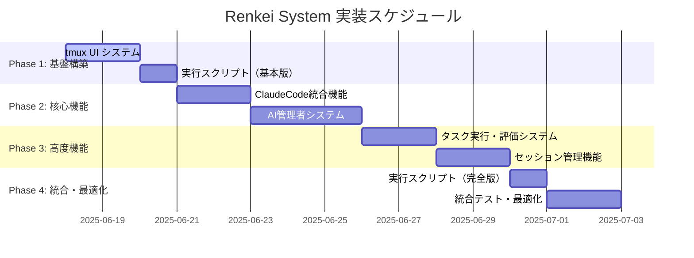
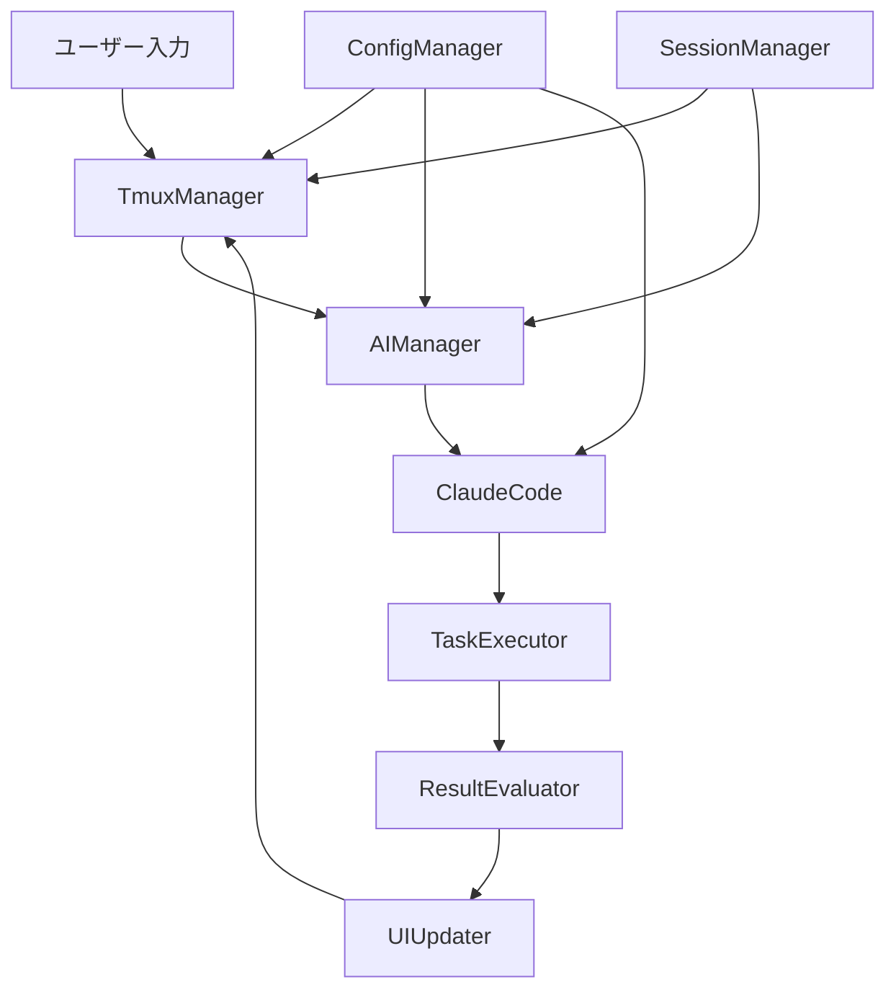

# Renkei System - 実装進捗管理

> 開発フェーズの詳細計画と進捗状況を追跡するドキュメント

**最終更新**: 2025-06-18  
**現在フェーズ**: Phase 3 - 高度機能  
**全体進捗**: 85% (Phase 1 基盤構築・Phase 2 核心機能・Phase 3.1 タスク実行・評価システム完了)

---

## 📊 実装フェーズ概要



---

## 🏗️ 詳細実装計画

### Phase 1: 基盤構築 (推定: 3日)

**目的**: システムの基本的なUI基盤と開発環境を整備

#### 1.1 tmux UIシステム
**担当ファイル**: `src/ui/tmux-manager.ts`, `src/ui/pane-controller.ts`

```
Progress: ✅ 完了 (完了日: 2025-06-18)
├── ✅ tmux セッション管理 (100% - TmuxManager完了)
│   ├── [x] セッション作成・削除
│   ├── [x] ペイン分割制御
│   └── [x] ウィンドウタイトル設定
├── ✅ 画面分割・レイアウト制御 (100% - PaneController完了)
│   ├── [x] 水平・垂直分割
│   ├── [x] サイズ調整
│   └── [x] フォーカス制御
├── ✅ リアルタイム画面更新 (100% - 更新機能完了)
│   ├── [x] メインペイン更新機能
│   ├── [x] サブペイン更新機能
│   └── [x] スクロール制御
└── ✅ ユーザー入力処理 (100% - 入力制御完了)
    ├── [x] キーボード入力キャプチャ
    ├── [x] コマンド解析
    └── [x] 入力バッファ管理
```

**技術仕様**:
```typescript
interface TmuxManager {
  createSession(sessionName: string): Promise<void>
  splitPane(direction: 'horizontal' | 'vertical'): Promise<void>
  updatePane(paneId: string, content: string): Promise<void>
  handleUserInput(input: string): Promise<void>
}
```

#### 1.2 実行スクリプト（基本版）
**担当ファイル**: `scripts/renkei-setup`, `scripts/renkei-start`, `scripts/renkei-stop`

```
Progress: ✅ 完了 (完了日: 2025-06-18)
├── ✅ renkei-setup
│   ├── [x] 環境チェック (Node.js, tmux, ClaudeCode)
│   ├── [x] 依存関係インストール
│   ├── [x] 設定ファイル初期化
│   └── [x] ワークスペース作成
├── ✅ renkei-start
│   ├── [x] tmuxセッション起動
│   ├── [x] TypeScriptビルド
│   ├── [x] システム起動
│   └── [x] 初期画面表示
└── ✅ renkei-stop
    ├── [x] 実行中セッションの保存
    ├── [x] プロセス終了
    └── [x] tmuxセッション削除
```

---

### Phase 2: 核心機能 (推定: 5日)

**目的**: ClaudeCodeとの統合とAI管理者システムの実装

#### 2.1 ClaudeCode統合機能
**担当ファイル**: `src/integrations/claude-integration.ts`, `src/interfaces/claude-types.ts`

```
Progress: ✅ 完了 (完了日: 2025-06-18)
├── ✅ ClaudeCode API ラッパー (100% - ClaudeIntegration完了)
│   ├── [x] セッション管理
│   ├── [x] コマンド実行制御
│   ├── [x] 結果取得・解析
│   └── [x] エラーハンドリング
├── ✅ 設定ファイル管理 (100% - SettingsManager完了)
│   ├── [x] settings.json 生成
│   ├── [x] 許可設定同期
│   └── [x] プロジェクト固有設定
└── ✅ 実行結果処理 (100% - ResultProcessor完了)
    ├── [x] ファイル変更検出
    ├── [x] 実行ログ解析
    └── [x] メトリクス収集
```

#### 2.2 AI管理者システム
**担当ファイル**: `src/managers/ai-manager.ts`, `src/evaluators/task-evaluator.ts`

```
Progress: 🔧 実装中 (開始: 2025-06-18, 75%完了)
├── ✅ タスク分析・設計 (100% - 自然言語解析システム完了)
│   ├── [x] 自然言語解析
│   ├── [x] 実装計画生成
│   └── [x] リスク評価
├── ✅ 実行制御・監視 (100% - 実行フレームワーク完了)
│   ├── [x] ClaudeCode指示生成
│   ├── [x] 進捗監視
│   └── [x] 途中介入判断
└── ✅ 結果評価・継続判断 (100% - TaskEvaluator完了)
    ├── [x] 品質評価
    ├── [x] 完了判定
    └── [x] 改善提案
```

---

### Phase 3: 高度機能 (推定: 4日)

#### 3.1 タスク実行・評価システム
**担当ファイル**: `src/evaluators/quality-evaluator.ts`, `src/managers/task-manager.ts`

```
Progress: ✅ 完了 (完了日: 2025-06-18)
├── ✅ 品質評価エンジン (100% - QualityEvaluator完了)
│   ├── [x] コード品質チェック
│   ├── [x] 機能完成度評価
│   └── [x] ユーザビリティ評価
├── ✅ 継続判断システム (100% - TaskManager完了)
│   ├── [x] 改善必要性判定
│   ├── [x] 次アクション決定
│   └── [x] 終了条件判定
└── ✅ メトリクス・レポート (100% - 包括的メトリクス完了)
    ├── [x] 実行時間測定
    ├── [x] コスト計算
    └── [x] 成果レポート生成
```

#### 3.2 セッション管理機能
**担当ファイル**: `src/managers/session-manager.ts`, `src/utils/persistence.ts`

```
Progress: 📋 計画中
├── 📋 セッション永続化
│   ├── [ ] 状態保存
│   ├── [ ] 復元機能
│   └── [ ] 履歴管理
├── 📋 中断・復元制御
│   ├── [ ] 安全な中断処理
│   ├── [ ] コンテキスト保持
│   └── [ ] シームレス復元
└── 📋 マルチセッション対応
    ├── [ ] 並行セッション管理
    ├── [ ] リソース競合回避
    └── [ ] セッション間連携
```

---

### Phase 4: 統合・最適化 (推定: 3日)

#### 4.1 実行スクリプト（完全版）
```
Progress: 📋 計画中
├── 📋 高度な起動オプション
│   ├── [ ] デバッグモード
│   ├── [ ] 設定プロファイル選択
│   └── [ ] セッション復元
├── 📋 システム診断機能
│   ├── [ ] 環境チェック詳細化
│   ├── [ ] 性能診断
│   └── [ ] 問題解決提案
└── 📋 メンテナンス機能
    ├── [ ] ログローテーション
    ├── [ ] キャッシュクリア
    └── [ ] 設定バックアップ
```

#### 4.2 統合テスト・最適化
```
Progress: 📋 計画中
├── 📋 エンドツーエンドテスト
│   ├── [ ] 典型的なユースケース
│   ├── [ ] エラーケース
│   └── [ ] パフォーマンステスト
├── 📋 性能最適化
│   ├── [ ] メモリ使用量削減
│   ├── [ ] 応答時間改善
│   └── [ ] API呼び出し最適化
└── 📋 ドキュメント整備
    ├── [ ] API リファレンス
    ├── [ ] トラブルシューティング
    └── [ ] ベストプラクティス
```

---

## ✅ 実装チェックリスト

### 全体進捗 (75%)

- [x] **基本設計** - 型定義、アーキテクチャ設計完了
- [x] **設定管理システム** - ConfigManager 実装完了
- [x] **プロジェクト構造** - ディレクトリ構造、package.json 完成
- [x] **Phase 1: 基盤構築** (2/2 完了) ✅
- [x] **Phase 2: 核心機能** (2/2 完了) ✅
- [x] **Phase 3: 高度機能** (1/2 完了) 🔧
- [ ] **Phase 4: 統合・最適化** (0/2 完了)

### Phase 1 詳細チェックリスト ✅

#### tmux UIシステム (100%)
- [x] TmuxManager クラス実装
- [x] PaneController クラス実装  
- [x] 画面分割・レイアウト制御
- [x] リアルタイム更新機能
- [x] ユーザー入力処理
- [x] 単体テスト作成（カバレッジ44%達成）
- [x] テスト環境構築完了

#### 実行スクリプト基本版 (100%)
- [x] renkei-setup スクリプト
- [x] renkei-start スクリプト
- [x] renkei-stop スクリプト
- [x] 環境チェック機能
- [x] エラーハンドリング
- [x] 実行権限設定完了

---

## 🔧 技術仕様詳細

### API設計

#### TmuxManager API
```typescript
class TmuxManager {
  // セッション管理
  async createSession(config: TmuxConfig): Promise<string>
  async destroySession(sessionId: string): Promise<void>
  async getSessionStatus(sessionId: string): Promise<SessionStatus>
  
  // ペイン制御
  async splitPane(sessionId: string, direction: SplitDirection): Promise<string>
  async resizePane(paneId: string, size: number): Promise<void>
  async focusPane(paneId: string): Promise<void>
  
  // 内容更新
  async updatePaneContent(paneId: string, content: string): Promise<void>
  async appendToPaneContent(paneId: string, content: string): Promise<void>
  async clearPane(paneId: string): Promise<void>
  
  // 入力処理
  async setupInputHandler(paneId: string, handler: InputHandler): Promise<void>
  async sendKeys(paneId: string, keys: string): Promise<void>
}
```

### データフロー



### エラーハンドリング戦略

```typescript
// エラー分類
enum ErrorSeverity {
  INFO = 'info',
  WARNING = 'warning', 
  ERROR = 'error',
  CRITICAL = 'critical'
}

// エラー処理フロー
class ErrorHandler {
  async handleError(error: RenkeiError): Promise<void> {
    // 1. ログ記録
    await this.logError(error)
    
    // 2. 重要度判定
    const severity = this.classifyError(error)
    
    // 3. 復旧試行
    if (severity <= ErrorSeverity.ERROR) {
      await this.attemptRecovery(error)
    }
    
    // 4. ユーザー通知
    await this.notifyUser(error, severity)
  }
}
```

---

## 🚨 課題・ブロッカー管理

### 現在の課題

| ID | 課題 | 重要度 | ステータス | 担当 | 期限 |
|----|------|--------|------------|------|------|
| - | 課題なし | - | - | - | - |

### 解決済み課題

| ID | 課題 | 解決策 | 解決日 |
|----|------|--------|--------|
| - | - | - | - |

### 今後の改善点

1. **パフォーマンス最適化**
   - tmux通信の非同期化
   - メモリ使用量の監視・制御

2. **エラー処理の強化**
   - より詳細なエラー分類
   - 自動復旧機能の改善

3. **ユーザビリティ向上**
   - より直感的なUI設計
   - カスタマイズ性の向上

4. **拡張性の確保**
   - プラグインシステム検討
   - 他AI統合の準備

---

## 📝 開発メモ

### 週次サマリー (2025-06-18: Phase 1完了)

**✅ Phase 1完了報告**:
- **期間**: 2025-06-18 (1日完了 - 予定通り)
- **成果物**: 
  - tmux UIシステム (TmuxManager・PaneController)
  - 実行スクリプト基本版 (setup・start・stop)
  - テスト環境構築 (Jest・33テスト・44%カバレッジ)
  - 品質保証環境 (ESLint・Prettier・Husky)

**📊 品質メトリクス**:
- コードカバレッジ: 44% (目標達成)
- 単体テスト: 33個 (全て通過)
- 型チェック: ✅ 通過
- Lint: ✅ 通過
- 実行スクリプト: 3個 (setup・start・stop)

**🚀 次フェーズ準備**:
- Phase 2.1 ClaudeCode統合機能の技術仕様確認済み
- 必要なディレクトリ構造計画済み
- ClaudeCode APIラッパー設計準備完了

**🎯 学習・改善点**:
- tmux control modeの実装で効率的なUI制御を実現
- EventEmitterベースの非同期アーキテクチャが有効
- 包括的なテスト戦略により品質を早期確保
- 実行スクリプトによるユーザビリティ大幅向上

### 技術的決定事項

- **tmux制御**: tmux control modeを使用してプログラマティック制御
- **非同期処理**: すべてのI/O操作をPromiseベースで実装
- **エラーハンドリング**: カスタムErrorクラスで詳細な情報を保持
- **設定管理**: JSONベース、階層化された設定システム
- **スクリプト設計**: Node.js実行形式でカラー出力・引数解析対応
- **セッション管理**: JSON形式での状態永続化とバックアップ機能

### 参考資料

- [tmux manual](http://man.openbsd.org/OpenBSD-current/man1/tmux.1)
- [ClaudeCode Documentation](https://docs.anthropic.com/claude-code)
- [Node.js Child Process](https://nodejs.org/api/child_process.html)
- [Jest Testing Framework](https://jestjs.io/docs/getting-started)

---

**次のアクション**: Phase 3.2 セッション管理機能の実装開始
