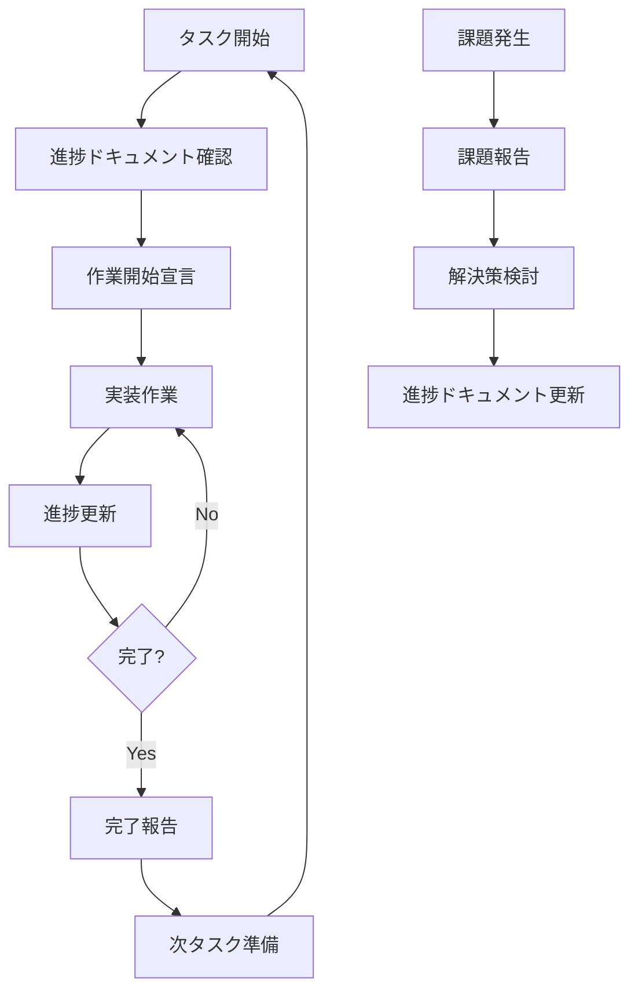

# Renkei System - 進捗管理運用ルール

> 実装進捗管理ドキュメント（07-implementation-progress.md）の運用標準化ルール

**対象ドキュメント**: `docs/renkei/07-implementation-progress.md`  
**最終更新**: 2025-06-18  
**ルールバージョン**: 1.0

---

## 🎯 運用ルールの目的

このルールに従って作業することで：
- **自動的に**進捗ドキュメントが最新状態に保たれる
- **一貫した**進捗追跡が実現される
- **効率的な**コンテキスト共有が可能になる
- **品質の高い**実装管理が継続される

---

## 📋 基本運用フロー



---

## 🚀 1. 作業開始時の手順

### 1.1 進捗ドキュメントの確認

**必須アクション**:
```bash
# 1. 最新の進捗ドキュメントを確認
less docs/renkei/07-implementation-progress.md

# 2. 現在のフェーズと次のタスクを確認
# 「次のアクション」セクションをチェック
```

**確認項目**:
- [ ] 現在のフェーズ
- [ ] 次に実装するタスク
- [ ] 前提条件・依存関係
- [ ] 技術仕様詳細

### 1.2 作業開始宣言

**進捗ドキュメント更新**:
```markdown
# 07-implementation-progress.md の更新場所

## 🏗️ 詳細実装計画
### Phase X: [フェーズ名]
#### X.X [タスク名]
```
Progress: ⏳ 実装中 → 🔧 実装中 (開始日: YYYY-MM-DD)
```

**更新テンプレート**:
```markdown
Progress: 🔧 実装中 (開始: 2025-06-18)
├── ✅ [完了した項目]
├── 🔧 [実装中の項目] ← NEW
├── ⏳ [待機中の項目]
└── 📋 [計画中の項目]
```

---

## 🔄 2. 実装中の進捗更新手順

### 2.1 日次進捗更新

**更新タイミング**: 1日に1回以上
**更新場所**: 該当するタスクの Progress セクション

**更新例**:
```markdown
# 更新前
├── 🔧 tmux セッション管理

# 更新後  
├── 🔧 tmux セッション管理 (60% - セッション作成完了)
│   ├── ✅ セッション作成・削除
│   ├── 🔧 ペイン分割制御 ← 実装中
│   └── 📋 ウィンドウタイトル設定
```

### 2.2 実装完了時の更新

**チェックリスト更新**:
```markdown
# ✅ 実装チェックリスト
### Phase X 詳細チェックリスト

#### [タスク名] (XX% → 100%)
- [x] 項目1 ← チェック済みに変更
- [x] 項目2 ← チェック済みに変更
- [ ] 項目3
```

**全体進捗の更新**:
```markdown
# 全体進捗の計算式
# (完了タスク数 / 全タスク数) × 100

**全体進捗**: 15% → 25% (ConfigManager + TmuxManager完了)
```

---

## ✅ 3. 完了報告手順

### 3.1 タスク完了時

**必須更新項目**:
1. **Progress ステータス変更**
   ```markdown
   Progress: 🔧 実装中 → ✅ 完了 (完了日: 2025-06-18)
   ```

2. **チェックリスト更新**
   ```markdown
   #### tmux UIシステム (0% → 100%)
   - [x] TmuxManager クラス実装
   - [x] PaneController クラス実装
   - [x] 画面分割・レイアウト制御
   ```

3. **全体進捗更新**
   ```markdown
   **全体進捗**: 15% → 25%
   - [x] **Phase 1.1: tmux UIシステム** ← NEW
   ```

4. **次のアクション更新**
   ```markdown
   **次のアクション**: Phase 1.2 実行スクリプト（基本版）の実装開始
   ```

### 3.2 フェーズ完了時

**追加更新項目**:
```markdown
- [x] **Phase 1: 基盤構築** (2/2 完了) ← NEW
- [ ] **Phase 2: 核心機能** (0/2 完了)
```

---

## 🚨 4. 課題・ブロッカー報告手順

### 4.1 課題発生時

**課題テーブル更新**:
```markdown
## 🚨 課題・ブロッカー管理
### 現在の課題

| ID | 課題 | 重要度 | ステータス | 担当 | 期限 |
|----|------|--------|------------|------|------|
| P1-001 | tmux制御でのエラーハンドリング | High | 調査中 | Dev | 2025-06-19 |
```

**課題ID命名規則**:
- `P[Phase]-[連番]` (例: P1-001, P2-003)

### 4.2 課題解決時

**解決済みテーブルに移動**:
```markdown
### 解決済み課題

| ID | 課題 | 解決策 | 解決日 |
|----|------|--------|--------|
| P1-001 | tmux制御エラー | control mode使用 | 2025-06-18 |
```

---

## 📝 5. ドキュメント更新の自動化ルール

### 5.1 更新頻度

| 更新タイミング | 更新内容 | 必須度 |
|----------------|----------|--------|
| 作業開始時 | Progress ステータス | 必須 |
| 日次 (1回以上) | 詳細進捗 | 必須 |
| 項目完了時 | チェックリスト | 必須 |
| タスク完了時 | 全体進捗・次アクション | 必須 |
| 課題発生時 | 課題テーブル | 必須 |
| 週次 | 改善点・メモ | 推奨 |

### 5.2 更新品質チェック

**更新前チェックリスト**:
- [ ] 日付が正確か
- [ ] 進捗率が妥当か  
- [ ] チェックボックスの状態が正しいか
- [ ] 次のアクションが更新されているか
- [ ] 課題の状況が最新か

---

## 🔧 6. 実装作業の標準手順

### 6.1 新機能実装の流れ

```bash
# 1. 進捗ドキュメント確認・更新
vim docs/renkei/07-implementation-progress.md

# 2. 実装開始宣言
# Progress: 📋 計画中 → 🔧 実装中

# 3. 実装作業
mkdir -p src/ui  # 必要なディレクトリ作成
touch src/ui/tmux-manager.ts  # ファイル作成
# ... 実装 ...

# 4. 日次進捗更新
# Progress詳細の更新

# 5. 完了時の最終更新
# チェックリスト・全体進捗・次アクション更新
```

### 6.2 実装品質の確保

**各実装完了時の必須チェック**:
- [ ] TypeScript型チェック通過
- [ ] ESLint チェック通過
- [ ] 基本的な動作確認
- [ ] エラーハンドリング実装
- [ ] ドキュメント更新

---

## 📊 7. 進捗測定とレポート

### 7.1 進捗率の計算方法

**タスクレベル**:
```
タスク進捗率 = (完了項目数 / 全項目数) × 100
```

**フェーズレベル**:
```
フェーズ進捗率 = (完了タスク数 / 全タスク数) × 100
```

**全体レベル**:
```
全体進捗率 = Σ(各フェーズ重み × フェーズ進捗率)

フェーズ重み:
- Phase 1: 20%
- Phase 2: 35% 
- Phase 3: 30%
- Phase 4: 15%
```

### 7.2 週次レポート

**毎週金曜日に更新**:
```markdown
## 📝 開発メモ
### 週次サマリー (2025-06-16〜2025-06-22)

**今週の成果**:
- ✅ Phase 1.1 tmux UIシステム完了
- 🔧 Phase 1.2 実行スクリプト 50%完了

**来週の予定**:
- Phase 1.2 完了
- Phase 2.1 ClaudeCode統合開始

**課題・改善点**:
- tmux制御の応答性向上が必要
```

---

## 🎯 8. 品質保証ルール

### 8.1 実装完了の定義

**各項目完了の条件**:
1. ✅ コード実装完了
2. ✅ 型チェック・Lint通過
3. ✅ 基本動作確認
4. ✅ エラーハンドリング実装
5. ✅ ドキュメント更新
6. ✅ 進捗ドキュメント更新
7. ✅ Gitコミット・プッシュ完了

### 8.2 フェーズ完了の条件

**Phase完了の定義**:
1. ✅ 全タスク100%完了
2. ✅ 統合テスト通過
3. ✅ 次フェーズの前提条件確認
4. ✅ 技術仕様ドキュメント更新
5. ✅ 課題・改善点の整理
6. ✅ 全変更のGitコミット・プッシュ

---

## 🚀 9. 運用開始チェックリスト

### 9.1 初回セットアップ

**開発者向けチェックリスト**:
- [ ] このルールドキュメントを読了
- [ ] 進捗ドキュメントの構造を理解
- [ ] 更新手順を確認
- [ ] 課題報告手順を確認
- [ ] 品質保証ルールを確認

### 9.2 日常運用チェックリスト

**毎日の作業開始時**:
- [ ] 進捗ドキュメント最新版確認
- [ ] 現在のタスク・次のタスク確認  
- [ ] 課題・ブロッカー状況確認

**毎日の作業終了時**:
- [ ] 進捗ドキュメント更新
- [ ] 明日のタスク準備
- [ ] 課題があれば報告

---

## 📞 10. サポート・質問

### 10.1 ルール適用で困った時

**対処手順**:
1. このドキュメントを再確認
2. 進捗ドキュメントのサンプル部分を参考
3. 過去の更新履歴を確認
4. 不明な場合は課題として報告

### 10.2 ルール改善提案

**改善提案の手順**:
1. 課題テーブルに改善提案を記載
2. 具体的な改善案を添付
3. 影響範囲・メリットを明記

---

## 🎯 運用成功の指標

**このルールが正しく運用されている状態**:
- ✅ 進捗ドキュメントが常に最新
- ✅ 全開発者が進捗状況を把握
- ✅ 課題が迅速に発見・解決
- ✅ 実装品質が一定水準を保持
- ✅ フェーズ間の移行がスムーズ

---

**このルールに従って作業することで、進捗管理が自動化され、高品質な実装が継続的に実現されます。**
