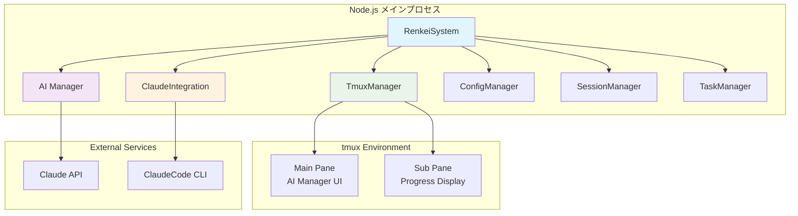

# Renkei System - アーキテクチャと実装ガイド

## 概要

Renkeiシステムは、tmuxベースのAI協調開発環境として設計された、TypeScriptで実装されたNode.jsアプリケーションです。本ドキュメントでは、現在の実装状況、アーキテクチャの詳細、実装の勘所について詳しく説明します。

## 1. システム全体アーキテクチャ

### 1.1 基本構成



### 1.2 技術スタック

- **Runtime**: Node.js 18.x+
- **言語**: TypeScript 5.6+
- **AI統合**: Claude API, ClaudeCode CLI
- **UI**: tmux (terminal multiplexer)
- **テスト**: Jest
- **品質管理**: ESLint, Prettier, Husky

## 2. 主要コンポーネント詳細

### 2.1 RenkeiSystem (メインエントリポイント)

**ファイル**: `src/index.ts`

```typescript
export class RenkeiSystem extends EventEmitter {
  // システムの中核制御クラス
  // - 全コンポーネントの初期化・管理
  // - 主要イベントループの制御
  // - ワーカープロセス管理
}
```

**実装の勘所**:
- EventEmitterを継承し、システム全体のイベント駆動アーキテクチャを実現
- 各コンポーネントの依存関係を適切に管理
- 非同期処理とエラーハンドリングの中央制御

### 2.2 AI Manager (タスク分析・実行制御)

**ファイル**: `src/managers/ai-manager.ts`

AI管理者システムの核心部分で、以下の機能を実装:

```typescript
export class AIManager extends EventEmitter {
  // 1. 自然言語タスク解析
  async analyzeTask(request: TaskRequest): Promise<TaskPlan>
  
  // 2. 実装計画生成
  private async generateImplementationPlan(): Promise<TaskPlan>
  
  // 3. リスク評価
  private async assessRisks(plan: TaskPlan): Promise<RiskAssessment>
  
  // 4. 実行制御・監視
  async executeTask(plan: TaskPlan): Promise<ExecutionResult>
}
```

**実装の勘所**:
- **段階的処理**: タスクを「分析→計画→実行→評価」の段階に分割
- **イベント駆動**: 各段階でイベントを発生させ、UI更新と監視を実現
- **エラー処理**: RenkeiErrorクラスを使用した構造化エラーハンドリング
- **JSON解析**: Claude APIからのレスポンスを構造化データに変換

### 2.3 Claude Integration (API統合)

**ファイル**: `src/integrations/claude-integration.ts`

ClaudeCode CLI との統合を担当:

```typescript
export class ClaudeIntegration extends EventEmitter {
  // セッション管理
  async createSession(workingDirectory?: string): Promise<string>
  
  // タスク実行
  async executeTask(sessionId: string, query: ClaudeQueryOptions): Promise<string>
  
  // プロセス制御
  private async runClaudeCodeProcess(task: ClaudeTaskExecution): Promise<SDKResult>
}
```

**実装の勘所**:
- **プロセス管理**: child_processを使用したClaudeCode CLIの制御
- **ストリーム処理**: stdout/stderrのリアルタイム処理
- **タイムアウト制御**: 長時間実行のタスクに対する適切なタイムアウト設定
- **セッション永続化**: セッション状態の保存と復元

### 2.4 Tmux Manager (UI制御)

**ファイル**: `src/ui/tmux-manager.ts`

tmuxセッション管理とペイン制御:

```typescript
export class TmuxManager extends EventEmitter {
  // セッション管理
  async createSession(sessionName?: string): Promise<string>
  
  // ペイン制御
  async splitPane(sessionId: string, direction: SplitDirection): Promise<string>
  
  // 内容更新
  async updatePaneContent(paneId: string, content: string): Promise<void>
}
```

**実装の勘所**:
- **コマンド実行**: tmuxコマンドのPromiseラップ
- **エラーハンドリング**: tmux固有のエラーメッセージの適切な処理
- **状態管理**: ペイン状態の追跡と同期
- **非同期制御**: 複数ペインの並行更新

## 3. 型定義システム

### 3.1 包括的型定義

**ファイル**: `src/interfaces/types.ts`

```typescript
// システム設定
export interface RenkeiConfig {
  version: string;
  workspaceDir: string;
  tmux: TmuxConfig;
  claude: ClaudeConfig;
  permissions: PermissionConfig;
}

// タスク関連
export interface TaskRequest {
  id: string;
  userPrompt: string;
  priority: 'low' | 'medium' | 'high';
  deadline?: Date;
}

// AI Manager関連
export interface TaskPlan {
  id: string;
  phases: TaskPhase[];
  riskAssessment: RiskAssessment;
  estimatedDuration: number;
  confidence: number;
}
```

**実装の勘所**:
- **厳密な型定義**: TypeScriptの型安全性を最大限活用
- **階層的構造**: システムの複雑性を適切にモデル化
- **イベント型**: EventEmitterと連携したイベント型定義
- **エラー型**: 構造化エラーハンドリングのための専用型

### 3.2 Claude統合型

**ファイル**: `src/interfaces/claude-types.ts`

Claude API とのやり取りに特化した型定義を提供。

## 4. 実装パターンと勘所

### 4.1 エラーハンドリングパターン

```typescript
// 構造化エラーハンドリング
export class RenkeiError extends Error {
  constructor(
    message: string,
    public code: string,
    public severity: ErrorSeverity,
    public originalError?: unknown,
    public details?: string
  ) {
    super(message);
  }
}

// 使用例
try {
  await this.executeTask(plan);
} catch (error) {
  const renkeiError = new RenkeiError(
    'Task execution failed',
    'AI_MANAGER_EXECUTION_ERROR',
    ErrorSeverity.ERROR,
    error
  );
  this.emit(AIManagerEvents.ERROR, renkeiError);
  throw renkeiError;
}
```

### 4.2 イベント駆動アーキテクチャ

```typescript
// イベントベースの通信
export enum AIManagerEvents {
  TASK_ANALYSIS_STARTED = 'task_analysis_started',
  TASK_ANALYSIS_COMPLETED = 'task_analysis_completed',
  TASK_EXECUTION_STARTED = 'task_execution_started',
  // ...
}

// 実装例
this.emit(AIManagerEvents.TASK_ANALYSIS_STARTED, request);
```

**勘所**:
- システム全体をイベント駆動で設計
- 各コンポーネント間の疎結合を実現
- UI更新とロジックの分離

### 4.3 非同期処理パターン

```typescript
// Promise chain ではなく async/await を使用
async executePhase(phase: TaskPhase): Promise<PhaseResult> {
  const phaseResults = [];
  
  for (const step of phase.steps) {
    this.emit(AIManagerEvents.STEP_STARTED, step);
    
    try {
      const stepResult = await this.executeStep(step);
      phaseResults.push(stepResult);
      this.emit(AIManagerEvents.STEP_COMPLETED, { step, result: stepResult });
    } catch (error) {
      this.emit(AIManagerEvents.STEP_FAILED, { step, error });
      throw error;
    }
  }
  
  return { phaseId: phase.id, results: phaseResults };
}
```

### 4.4 設定管理パターン

```typescript
// 階層的設定管理
export class ConfigManager {
  private config: RenkeiConfig;
  
  async loadConfig(): Promise<RenkeiConfig> {
    // デフォルト設定 + ユーザー設定のマージ
    const defaultConfig = await this.loadDefaultConfig();
    const userConfig = await this.loadUserConfig();
    
    return this.mergeConfigs(defaultConfig, userConfig);
  }
}
```

## 5. セキュリティ設計

### 5.1 許可システム

```typescript
// workspace/settings.json
{
  "permissions": {
    "allow": ["*"],
    "deny": ["rm -rf", "sudo", "chmod +x"]
  },
  "workspaceRestrictions": {
    "allowedDirectories": ["/workspace"],
    "forbiddenDirectories": ["/etc", "/var", "/sys"]
  }
}
```

**勘所**:
- ホワイトリスト/ブラックリスト方式の組み合わせ
- ファイルシステムアクセスの制限
- 危険なコマンドの実行防止

### 5.2 サンドボックス化

- 作業ディレクトリの制限
- プロセス実行権限の制御
- ネットワークアクセスの制限

## 6. パフォーマンス最適化

### 6.1 非同期処理最適化

**ファイル**: `src/utils/performance-optimizer.ts`

```typescript
export class PerformanceOptimizer {
  private readonly CONCURRENT_LIMIT = 3;
  
  async executeConcurrentTasks<T>(tasks: (() => Promise<T>)[]): Promise<T[]> {
    const semaphore = new Semaphore(this.CONCURRENT_LIMIT);
    // セマフォを使用した並行実行制御
  }
}
```

### 6.2 メモリ管理

```typescript
export class MemoryManager {
  private readonly MAX_HISTORY_SIZE = 100;
  
  cleanup(): void {
    this.sessionHistory = this.sessionHistory.slice(-10);
    global.gc?.();
  }
}
```

## 7. テスト戦略

### 7.1 テスト構成

```
src/
├── __tests__/
│   ├── setup.ts              # テスト環境設定
│   ├── calculator.test.ts    # ユニットテスト例
│   └── e2e/
│       └── integration.test.ts # 統合テスト
├── managers/__tests__/
│   └── config-manager.test.ts # コンポーネントテスト
└── ui/__tests__/
    └── tmux-manager.test.ts   # UIテスト
```

### 7.2 テスト設定

**ファイル**: `jest.config.js`

```javascript
module.exports = {
  preset: 'ts-jest',
  testEnvironment: 'node',
  collectCoverageFrom: [
    'src/**/*.{ts,tsx}',
    '!src/**/*.d.ts',
  ],
  coverageThreshold: {
    global: {
      lines: 50,
      functions: 50,
      branches: 50,
      statements: 50,
    },
  },
};
```

## 8. 開発・運用ガイド

### 8.1 開発環境セットアップ

```bash
# 依存関係インストール
npm install

# 開発サーバー起動
npm run dev

# テスト実行
npm test

# 品質チェック
npm run check
```

### 8.2 ビルドとデプロイ

```bash
# TypeScriptコンパイル
npm run build

# 本番環境起動
npm start

# システム診断
./scripts/renkei-setup
```

### 8.3 設定ファイル

**config/default-settings.json**:
```json
{
  "tmux": {
    "sessionName": "renkei",
    "mainPaneTitle": "AI Manager",
    "subPaneTitle": "ClaudeCode",
    "splitDirection": "horizontal",
    "mainPaneSize": 80
  },
  "claude": {
    "maxTurns": 10,
    "timeout": 30000,
    "outputFormat": "json",
    "allowedTools": ["read_file", "write_to_file", "execute_command"]
  }
}
```

## 9. 現在の実装状況

### 9.1 完成済み機能

✅ **基盤システム**
- TypeScript基盤構築
- イベント駆動アーキテクチャ
- 型定義システム
- 設定管理システム

✅ **AI Manager**
- 自然言語解析
- タスク計画生成
- リスク評価
- 段階的実行制御

✅ **Claude統合**
- ClaudeCode CLI統合
- セッション管理
- プロセス制御
- エラーハンドリング

✅ **UI システム**
- tmux セッション管理
- ペイン制御
- リアルタイム更新

✅ **品質管理**
- テスト環境
- ESLint/Prettier
- Git hooks (Husky)

### 9.2 進行中の機能

🔄 **エラーハンドリングの強化**
- より詳細なエラー分類
- 復旧機能の実装

🔄 **パフォーマンス最適化**
- 並行処理の改善
- メモリ管理の強化

### 9.3 計画中の機能

📋 **追加機能**
- プラグインシステム
- カスタムAI連携
- Web UI オプション
- 詳細なロギング

## 10. 重要な実装の勘所

### 10.1 コード品質

1. **型安全性**: TypeScriptの厳格モードを使用
2. **エラーハンドリング**: 構造化エラーとリカバリー機能
3. **テスタビリティ**: 依存性注入とモック可能な設計
4. **保守性**: 小さく責任が明確なクラス設計

### 10.2 非同期処理

1. **Promiseの適切な使用**: async/awaitパターンの徹底
2. **エラー伝播**: 適切なtry-catch構造
3. **リソース管理**: 明示的なクリーンアップ処理
4. **タイムアウト**: 長時間実行の制御

### 10.3 イベント駆動設計

1. **疎結合**: コンポーネント間の依存関係最小化
2. **リアクティブ**: 状態変化への即座の対応
3. **デバッグ性**: イベントトレースによる問題特定
4. **拡張性**: 新機能の追加が容易

### 10.4 セキュリティ

1. **入力検証**: 全ての外部入力の検証
2. **権限制御**: 最小権限の原則
3. **サンドボックス**: 実行環境の制限
4. **監査ログ**: 全操作の記録

## 11. 今後の課題と改善点

### 11.1 技術的課題

1. **スケーラビリティ**: 大規模プロジェクトへの対応
2. **パフォーマンス**: CPU・メモリ使用量の最適化
3. **安定性**: 長時間実行時の安定性向上
4. **互換性**: 異なる環境での動作保証

### 11.2 機能拡張

1. **AI統合**: 複数AIサービスの対応
2. **UI改善**: Web UIオプションの追加
3. **協調機能**: チーム開発機能
4. **プラグイン対応**: カスタマイズ機能

### 11.3 運用改善

1. **監視**: システム監視機能の強化
2. **デバッグ**: トラブルシューティング機能
3. **ドキュメント**: 使用例とベストプラクティス
4. **コミュニティ**: 開発者コミュニティの構築

---

## まとめ

Renkeiシステムは、TypeScriptベースの堅牢なアーキテクチャ上に構築された、AI協調開発環境です。現在の実装では、基本的な機能が完成しており、実際の開発業務に使用可能な状態にあります。

今後は、パフォーマンスの最適化、機能拡張、そして実際の使用経験に基づく改善を進めていく予定です。

**参考ドキュメント**:
- [プロジェクト概要](01-project-overview.md)
- [アーキテクチャ設計](02-architecture-design.md)
- [技術仕様](03-technical-specs.md)
- [API リファレンス](../api-reference.md)

---

**更新履歴**:
- 2025-06-18: 初版作成
- 各セクションは実装進捗に応じて随時更新予定
